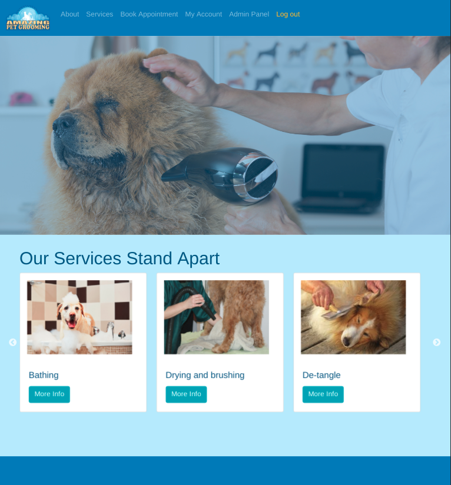
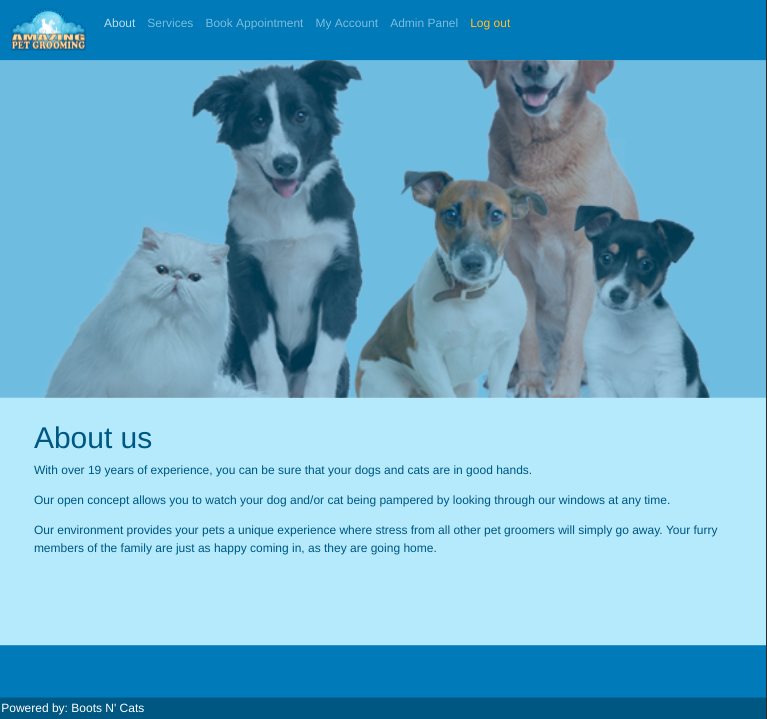
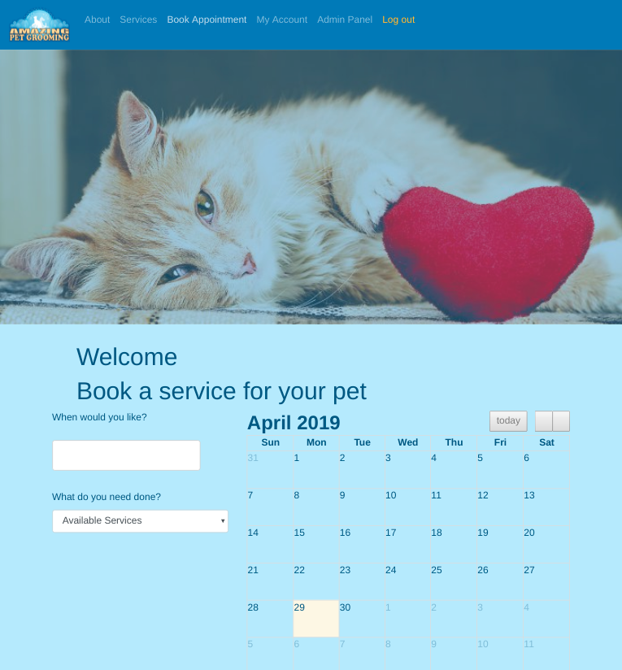
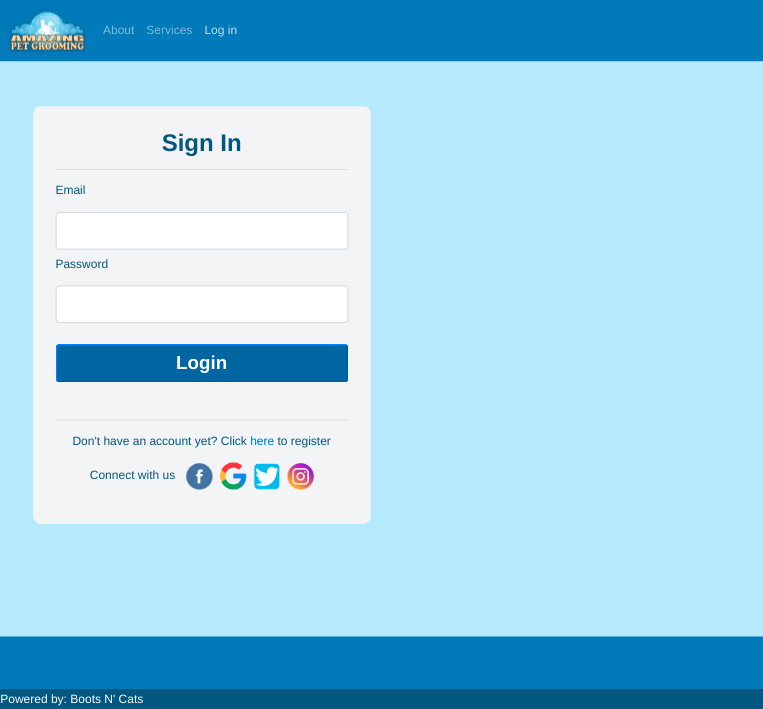
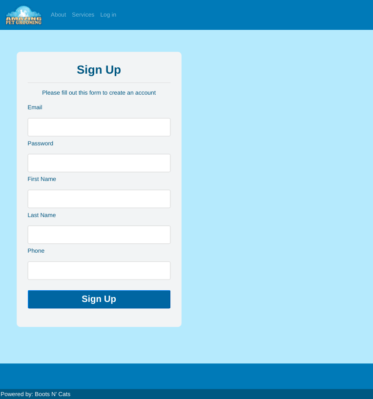
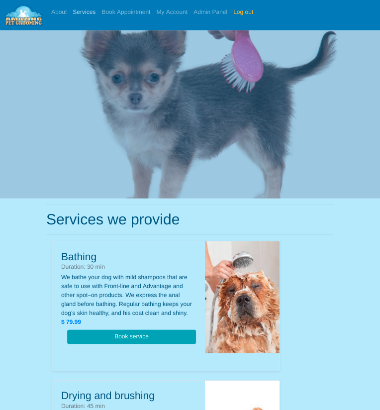
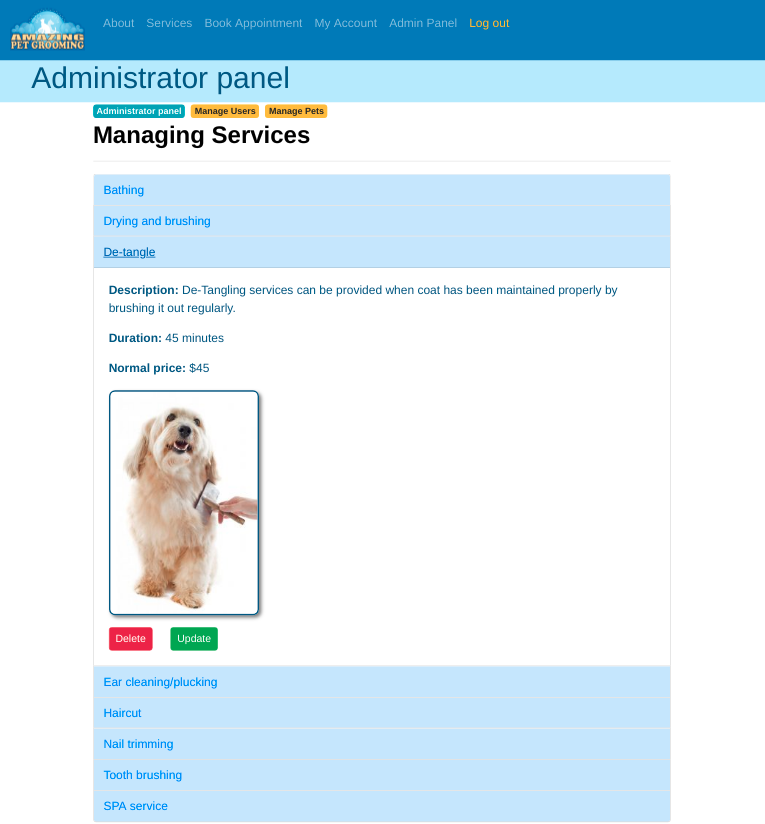
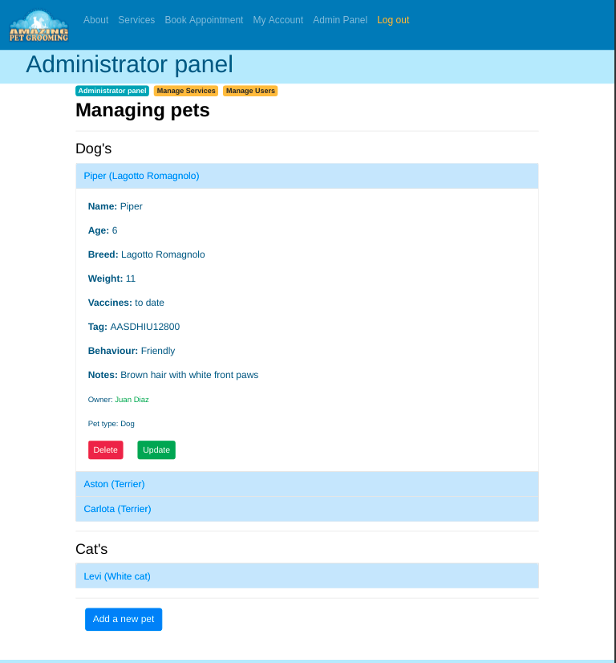
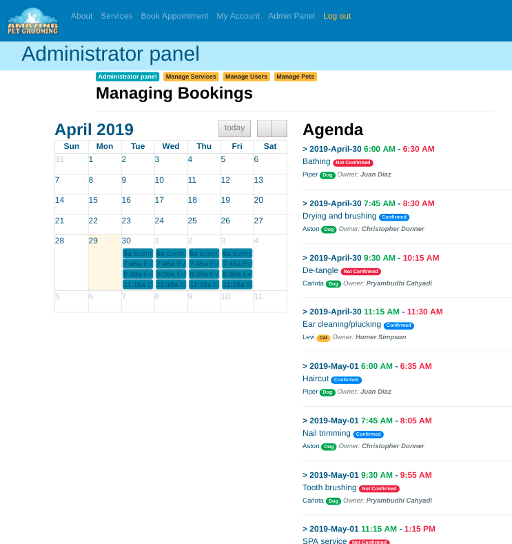
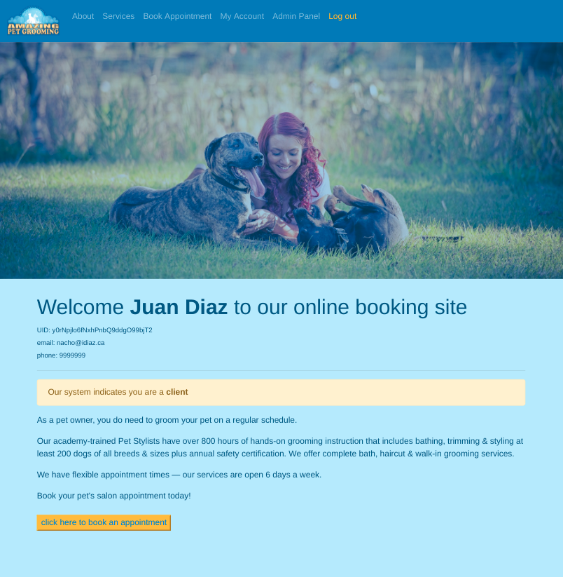

# VendorBooker
## Business management framework for small businesses ##

See the project [live](https://idiaz-vendorbooker.herokuapp.com/)!

> **Cretaed by**
- Christopher Donner @ <christopher.donner@gmail.com>!
- Alexis Yepes @ <alexisyep@gmail.com>!
- Pryambudhi Cahyadi @ <pcahyadi@gmail.com>!
- Juan I Diaz @ <jdi@idiaz.ca>!

> **Date:** April 2019

> ## Project Description

This project is a fully functional and fully responsive site deployed in [Heroku](https://idiaz-vendorbooker.herokuapp.com/). The idea behind this site is to provide small business owners with a platform where new and existing clients can come and book serives; allowing the owner to manage the sheduling of staff better.

The project is based on **node.js**, **express.js** and **react.js**. The back end is backed by **MongoDB** and **Mongoose** as the ORM. The aplication has been deployed in **Heroku** using their **mLab** database application.

> ## Building tools
- **FRONT END**
    - HTML, CSS
    - Javascript
    - React (JSX)
    - Bootstrap
    - AXIOS
    - REDUX
    - Full calendar
    - Google Firebase *(user authentication)*

- **BACK END**
    - node.js
    - Express
    - Mongoose / mLab MongoDB (Heroku)
    
- **Deployment**
    - Heroku

>**Screenshots**

*Home page - Desktop*

*About - Desktop*

*Booking - Desktop*

*Log-in page - Desktop*

*Signup page - Desktop*

*Services page - Desktop*

*Admin panel: managing users - Desktop*

*Admin panel: managing services - Desktop*

*Admin panel: managing pets - Desktop*

*Admin panel: managing events - Desktop*

*Client page - Desktop*

## QUESTIONS OR COMMENTS
- Feel free to contact the developers:
    - Christopher Donner @ <christopher.donner@gmail.com>!
    - Alexis Yepes @ <alexisyep@gmail.com>!
    - Pryambudhi Cahyadi @ <pcahyadi@gmail.com>!
    - Juan I Diaz @ <jdi@idiaz.ca>!
- See the **depolyed** project [live](https://idiaz-vendorbooker.herokuapp.com/)
